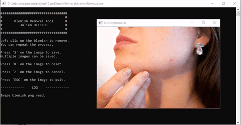

# OpenCV fun apps

This repo contains small projects/app that uses OpenCV.

## A - Python

### Dependencies

```python
import dlib
import cv2
import sys
import numpy as np
```

### Object Detection and tracking


Detect and track a sport ball in a video. YoloV3 is used for detection and the trackerTLD for the tracking.

The interface allows to force the sport ball redection to have a better accuracy.

#### How-to launch

```bash
> python detectionAndTracking.py
```

### Smile detection and bug eye


Compute facial landmarks detector then:
- Change the eyes so that they are way bigger - *Bug eye* ;
- Detect if the detected face is smiling or not.

#### How-to launch

```bash
> python funFaces.py
```

## B - C++

### Blemish Removal



Removing blemish by clicking on it.

#### How-to compile and run using CMake

```bash
> cd blemishRemoval
> mkdir build
> cd build
> cmake ..
> cmake --build . --config Release
> ./build/release/blemishRemoval
```

### Chroma Keying


Removing green background by selecting it.

#### How-to compile and run using CMake

```bash
> cd chromaKeying
> mkdir build
> cd build
> cmake ..
> cmake --build . --config Release
> ./build/release/chromaKeying
```